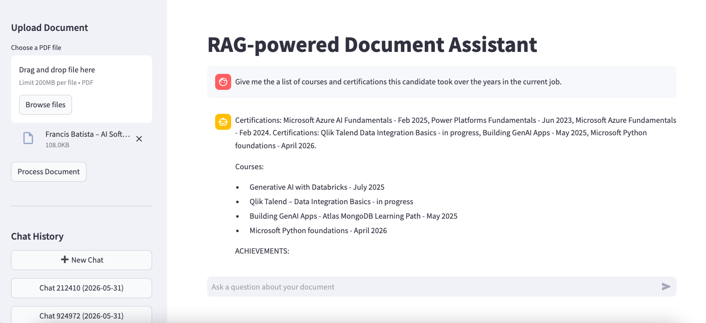

# RAG-powered Document Assistant

This is an interactive app where you can upload a PDF and then ask questions in natural language.  
For example, upload a technical report and get answers instantly, with citations.



Author: [Francis Batista](https://github.com/francisrod01)


## 🏗 Architecture

This assistant uses a Retrieval-Augmented Generation (RAG) architecture:
1. **Frontend**: Streamlit provides a simple UI to upload PDFs and ask questions.
2. **Backend**: A FastAPI server coordinates ingestion and retrieval.
3. **Storage**: Qdrant Vector Database stores document embeddings.
4. **LLM Engine**: Ollama runs models locally (`nomic-embed-text` for embeddings, `qwen2:1.5b` for generation).

## 📁 Project Structure

```text
rag-powered-document-assistant/
├── backend/
│   ├── app/
│   │   ├── __init__.py
│   │   ├── main.py
│   │   ├── ingestion.py
│   │   ├── retrieval.py
│   │   └── models.py
│   ├── requirements.txt
│   └── Dockerfile
├── frontend/
│   ├── app.py
│   ├── requirements.txt
│   └── Dockerfile
├── docker-compose.yml
└── .env
```


## 🚀 Quick Start Commands

```bash
cd project-folder

# Start all containers
docker compose up  -d --build

# Pull the AI models for Ollama to use
docker exec -it rag-powered-document-assistant-ollama-1 ollama pull nomic-embed-text
docker exec -it rag-powered-document-assistant-ollama-1 ollama pull qwen2:1.5b

# Alternatively, you can use the make command or provided scripts:
# make pull-model
```

Open your browser to check it out
- Frontend: http://localhost:8501
- API docs: http://localhost:8000/docs


## ✅ Test It

* Upload a PDF (any report, article, or book chapter)
* Wait for "Processing" to complete
* Ask questions like:
  - "What is the main topic of this document?"
  - "Summarise the key points"
  - "What does the document say about [specific term]"


## 🔧 Troubleshooting

| Issue | Fix |
|---|---|
| Ollama connection refused | Wait 10 seconds after `docker-compose up`, then pull model |
| Qdrant collection error | Delete volume: `docker-compose down -v`, then restart |
| Slow responses | Reduce CHUNK_SIZE in `ingestion.py` to 300 |
| Memory issues | Add to docker-compose: `deploy:` -> `resources:` -> `limits:` -> `memory: 2G` |


## License

Apache License 2.0
